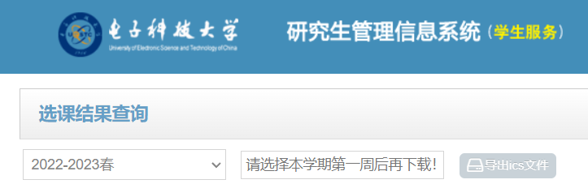
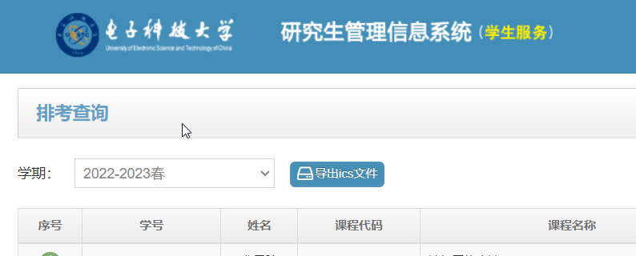

# 电子科技大学研究生课表考表导出

## 使用方法

### 安装

1. 确保你的浏览器上已经安装了tampermonkey扩展。
2. [在这里](https://greasyfork.org/zh-CN/scripts/460651-%E7%94%B5%E5%AD%90%E7%A7%91%E6%8A%80%E5%A4%A7%E5%AD%A6%E7%A0%94%E7%A9%B6%E7%94%9F%E8%AF%BE%E8%A1%A8%E8%80%83%E8%A1%A8%E5%AF%BC%E5%87%BA)将本脚本添加到你的浏览器中。

### 导出课表

访问[研究生系统/选课结果查询](https://yjsjy.uestc.edu.cn/pyxx/pygl/xkjg/index)就可以看到多出了一个选择框和一个按钮，在选择框中选择了本学期第一周后就可以点按按钮以`.ics`格式下载你的课表。

### 导出考表

访问[研究生系统/考试查询](https://yjsjy.uestc.edu.cn/pyxx/pygl/kskcxx/index)就可以看到多出了一个按钮，点按按钮后就可以`.ics`格式下载你的考表。

## 致谢

本项目参考了[uestc_graduate_syllabus](https://github.com/ygowill/uestc_graduate_syllabus)
